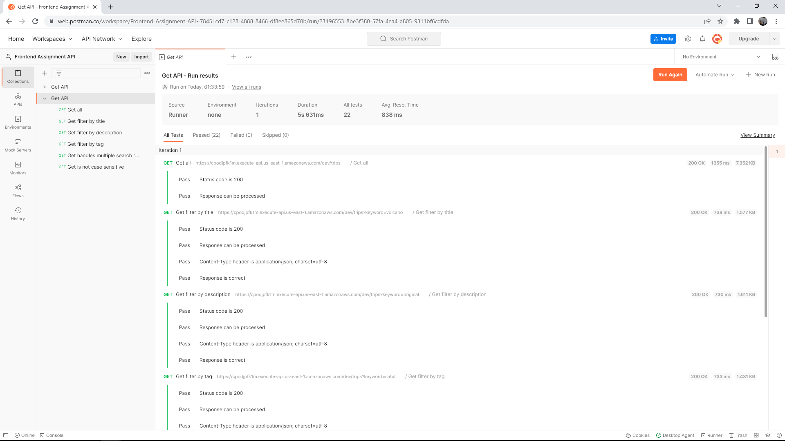

# Leila Iglesias - Frontend Assignment

## Run Code

- Ensure node modules in 'api-gateway' and 'web' folders are complete
- I used 'serverless deploy' to deploy the AWS server
- Use 'yarn start' and 'yarn test' for frontend

## Code Structure

### Frontend

#### Features:
- Title and 'Read more' redirect current tab to the article URL
- Each category is clickable - searches the tag
- URL is shareable, can be copied through the circular button to the right of the input

Tested rendering of search results item card

### API Gateway

Uses Express.js and Serverless
Logs requests in AWS CloudWatch at https://cpodjpfk1m.execute-api.us-east-1.amazonaws.com/dev/trips

#### Tests run

GET
  - all: /trips
  - filter by title: /trips?keyword=volcano
  - filter by description: /trips?keyword=original
  - filter by tag: /trips?keyword=satul
  - handle multiple search results: /trips?keyword=bangkok
  - not case sensitive: /trips?keyword=ORIGINAL

